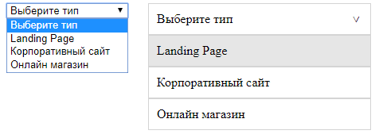

# Стилизация Select (Javascript)



Так как <b>select</b> не стилизуется напрямую, создается его клон <b>".select-wrapper"</b><br> Будем называть его псевдосписок. <br><br>
C помощью JavaScript синхронизируется выбор <b>option</b>

Рядом с обычным select указываем его будущую обертку:

```html

<select class="custom-select">
    <option selected>Выберите тип</option>
    <option>Landing Page</option>
    <option>Корпоративный сайт</option>
    <option>Онлайн магазин</option>
</select>

<div class="select-wrapper"></div>

```

Код JavaScript: 

```JavaScript

    // Примечание!
    // <select> не стилизуется напрямую, поэтому создается его клон ".select-wrapper" Будем называть его псевдосписок.

    var option = document.querySelectorAll('.custom-select option'),
        selectWrapper = document.querySelector('.select-wrapper');

    // Создание контейнера для псевдосписка
    var selectResult = document.createElement('div');
    selectResult.classList.add('select-result');
    selectWrapper.appendChild(selectResult);

    // Создание первого элемента псевдосписка. Здесь будет показан выбранный элемент
    var firstDiv = document.createElement('div');
    firstDiv.style.display = 'none';
    selectResult.appendChild(firstDiv);

    // Перебор <option> и копирование их в <div> и вставка в контейнер для псевдосписка
    option.forEach((item) => {
        let div = document.createElement('div');
        div.innerHTML = item.innerHTML;
        selectResult.appendChild(div);
    });

// Открытие\Закрытие псевдосписка
    document.querySelector('.select-wrapper').addEventListener('click', (e) => {
        selectResult.classList.toggle('select-active')
    });

    // Клик на каждом элементе псевдосписка
    document.querySelectorAll('.select-result div').forEach((item) => {
        item.addEventListener('click', (e) => {

            // Если псевдосписок раскрыт, то вставляем выбранный элемент на первую позицию и закрываем псевдосписок
            if (selectResult.classList.contains('select-active')) {
                document.querySelector('.select-result div').innerHTML = e.target.innerHTML;
                firstDiv.style.display = 'block';

                // <option selected> если совпадает содержимое с выбранным элементом псевдосписка
                option.forEach((item) => {
                    item.innerHTML === e.target.innerHTML ? item.selected = true : false;
                });
            }
        });
    });


    // Fix Убирает дублирование выбранного элемента в списке псевдосписка
    document.querySelectorAll('.select-result div').forEach((item) => {
        item.addEventListener('click', (e) => {
            if (selectResult.classList.contains('select-active')) {
                document.querySelectorAll('.select-result div').forEach((el) => {
                    el.classList.remove('display-none')
                });
                e.target.classList.add('display-none');
            }
        })
    });

    // Fix Убирает дублирование только первого элемента псевдосписка, который является заглушкой по умолчанию
    /* document.querySelectorAll('.select-result div').forEach((item) => {
         item.addEventListener('click', (e) => {
             if (selectResult.classList.contains('select-active') && e.target.innerHTML === document.querySelector('.custom-select option').innerHTML) {
                 e.target.classList.add('display-none');
             } else if (selectResult.classList.contains('select-active') && e.target.innerHTML !== document.querySelector('.custom-select option').innerHTML) {
                 document.querySelectorAll('.select-result div')[1].classList.remove('display-none')
             }
         })
     });*/


    // Fix Закрывает псевдосписок при клике вне его области
    document.addEventListener('click', function (e) {

        // ВАЖНО!
        // "ИЛИ" срабатывает после первого совпадения и дальше не проверяет
        // Поэтому, если убрать сравнение с document, то проверяется второе условие и при клике за пределы <html> появится ошибка typeError, так как у document нет метода .contains
        if (e.target.parentNode === document || !e.target.parentNode.classList.contains('select-active')) {
            selectResult.classList.remove('select-active');
        }
    });


    // BONUS
    // При клике на <option> выбирается соответствующий элемент в псевдосписке
    document.querySelector('.custom-select').addEventListener('change', (e) => {
        document.querySelectorAll('.select-result div').forEach((item) => {
            item.classList.remove('display-none')
        });
        document.querySelectorAll('.select-result div').forEach((item) => {
            if (item.innerHTML === e.target.options[e.target.selectedIndex].innerHTML) {
                item.classList.add('display-none');
                document.querySelector('.select-result div').innerHTML = item.innerHTML;
                firstDiv.style.display = 'block';
            }
        })
    });

```

